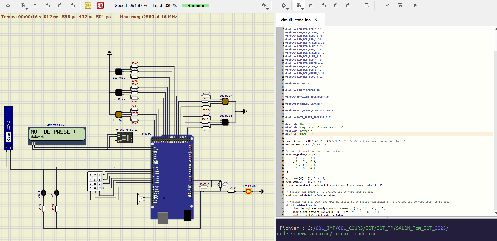
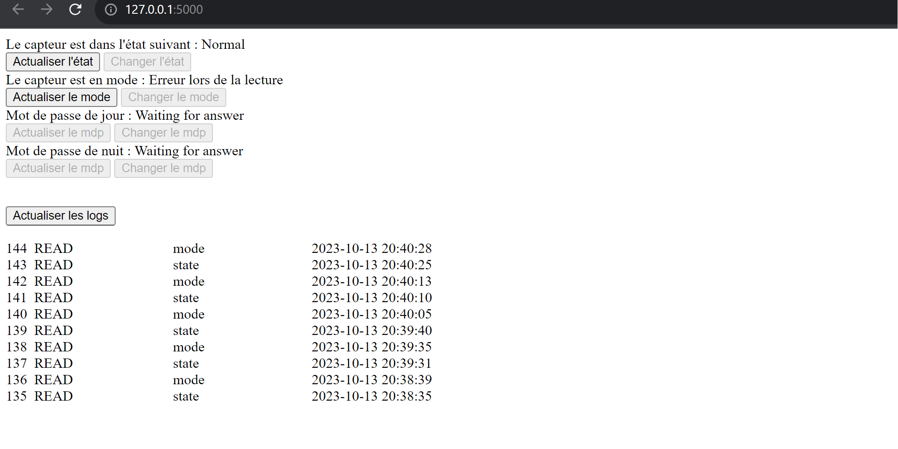
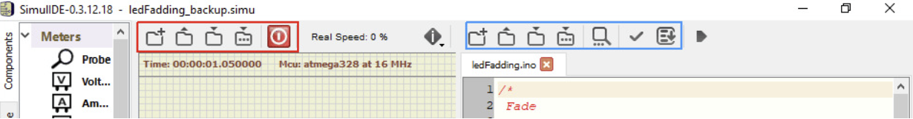

# [SCHOOL]

# Simulating a secure access system to a building with an Arduino and a Python server




This system is designed to simulate secure building access management using an Arduino and Python. It allows for various user scenarios, which will be explained progressively. The system will utilize an Arduino MEGA board and several components for functionality.

Here are the specifications we were given.


## Table of Contents

1. [Introduction](#introduction)
2. [Software Requirements](#software-requirements)
   1. [Virtual Serial Port Emulator (Windows only)](#virtual-serial-port-emulator-windows-only)
   2. [Serial Port Monitor (Windows only)](#serial-port-monitor-windows-only)
   3. [SimlIDE](#simlide)
   4. [PyCharm](#pycharm)
   5. [Arduino IDE](#arduino-ide)
3. [Tasks to be Completed](#tasks-to-be-completed)
   1. [System Functionality Specifications](#system-functionality-specifications)
   2. [Implementation of Modbus RTU Protocol](#implementation-of-modbus-rtu-protocol)
   3. [Password and Mode Management](#password-and-mode-management)
   4. [User Interface (UI)](#user-interface-ui)
   5. [Setting Up a SQLite Database](#setting-up-a-sqlite-database)
   6. [Creating a Python UI](#creating-a-python-ui)
4. [Launch the application](#launch)

### 1. Introduction

This mini-project aims to establish an IoT-based building access control terminal.
 You will be required to adhere to a specific set of requirements, some of which are similar to the lab exercises, while others will involve researching the operation of components and communication protocols.

The project builds upon the electronic circuit used in the lab but introduces the Modbus RTU communication protocol, along with additional components.

### 2. Software Requirements

This mini project requires the following software tools:

#### 2.1 "Virtual Serial Port Emulator" (Windows only)
This program allows you to create, test, and debug applications that use serial ports. It enables the creation of virtual devices to send and receive data. Unlike physical ports, virtual devices can be used by multiple applications simultaneously.

#### 2.2 "Serial Port Monitor" (Windows only)
This software is used to monitor the activity on a serial port, specifically the one where the PC and the sensor exchange frames using the MODBUS ASCII protocol.

#### 2.3 "SimlIDE"
SimlIDE is a real-time electronic circuit simulator that helps you learn and experiment with simple electronic circuits and microcontrollers, supporting PIC, AVR, and Arduino.

#### 2.4 "PyCharm"
PyCharm is an integrated development environment (IDE) for Python programming. It provides code analysis, a graphical debugger, unit testing support, version control integration, and web development support with Django.

#### 2.5 "Arduino IDE"
The Arduino IDE is a development environment used for programming Arduino boards. It allows you to edit, compile, and upload code to an Arduino board.

### 3. Tasks to be Completed

#### 3.1 System Functionality Specifications

Your system will simulate secure building access control, considering various user scenarios, as detailed throughout the project. The following key components and features are to be implemented:

- Replace the Arduino board used in the lab with an Arduino MEGA.
- Incorporate five RGB LEDs for displaying different system states.
- Include a buzzer to provide audible feedback based on system events.
- Integrate an LCD screen to guide the user through the access process.
- Add a keypad for user input, with keys 0-9, *, and #.
- Utilize a light-dependent resistor (LDR) to adjust screen backlight based on ambient light conditions.
- Implement a real-time clock (RTC) component using the DS1307 in I2C mode to manage time-based operations.
- Develop an interactive system that guides the user through the access process, requesting passwords and following these scenarios:
  - User cancels with a # key, and the terminal displays a farewell message and returns to the idle state.
  - In DAY mode, only the zone password is required. If the user enters the correct password with the *, the system proceeds with access granted.
  - In NIGHT mode, the user must enter the zone password followed by a second password for nighttime access.
  - If three incorrect password entries occur in succession, the system enters SECURITY mode. A Modbus request will be required to exit this mode.
  - The system can be reset using a specific Modbus request (authentication required).
- Implement an interactive system with Modbus RTU protocol for communication between the terminal and the PC. Use Modbus registers and functions to manage access control modes.
- Incorporate a built-in test mode (only available through the Modbus interface) for system verification.

#### 3.2 Implementation of Modbus RTU Protocol

The system will communicate with a PC, with a Python UI acting as the user interface, via the Modbus RTU protocol. This is one of the tasks involving the most research and new knowledge. The following tasks are required:

- Develop Python code to interact with the Arduino terminal using the Modbus RTU protocol.
- Allow for read and write operations with different data types.
- Implement the required security mechanisms to prevent unauthorized access to the terminal.
- Use a Python library for Modbus RTU communication.

#### 3.3 Password and Mode Management

Implement secure password management and access control modes. Here's a breakdown of what this task entails:

- Passwords are stored in a secure manner to prevent unauthorized access.
- Develop logic for DAY, NIGHT, and SECURITY modes.
- Use the Modbus interface for enabling and disabling modes.

#### 3.4 User Interface (UI)

The user interface is divided into two components:

1. **Onboard Terminal UI:** This is the UI displayed on the terminal's LCD screen. Develop a user-friendly interface that guides the user through the access process.

2. **PC UI (Python Interface):** Develop a Python user interface using PyCharm or similar. This interface is used to interact with the terminal, request access, and monitor the system.

#### 3.5 Setting Up a SQLite Database

Create and manage an SQLite database to store and retrieve system data, including:

- User access logs
- Access mode configurations
- Terminal status information

The database is primarily used by the Python UI for monitoring and retrieving system data.

#### 3.6 Creating a Python UI

Develop a Python UI using PyCharm or a similar development environment. This interface serves as the primary user interaction point for managing the IoT building access terminal.

- The Python UI communicates with the terminal using the Modbus RTU protocol.
- It provides functionalities for:
  - Requesting access to the building.
  - Displaying access logs.
  - Configuring access modes.
  - Monitoring the terminal's status.
  - Managing user data.

Your project should align with these requirements and deliver a secure, functional IoT building access management system. Make sure to document your work thoroughly, including code comments and system manuals.

### Launch

1. Emulate a Serial Port COM10 with a baudrate of 9600 with the VSPE software.

<br/>

2. Open SimulIDE and load the _circuit_projet.sim1_ through the folder icon with an arrow up (orange rectangle). Then load the _circuit_code.ino_ through the folder icon with an arrow up (blue rectangle). Once it is all set up, juste hit the power button to launch the simulation.



3. Open a cmd and got to the folder _code_python and run the following commands :

```
pip install -r requirements_salon_tom.txt
flask --app main.py run -h 127.0.0.1 -p 5000
```